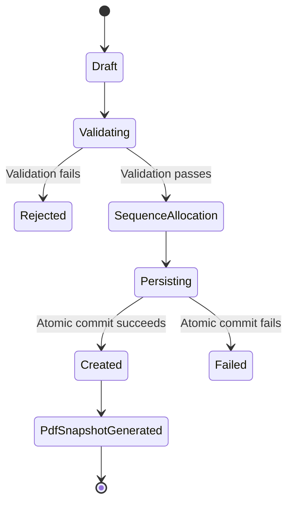
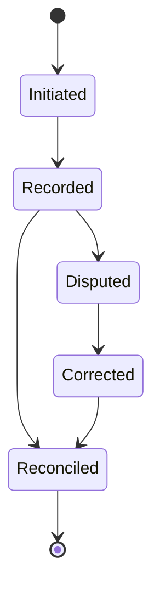
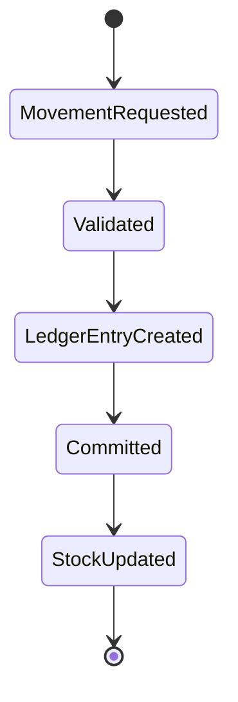
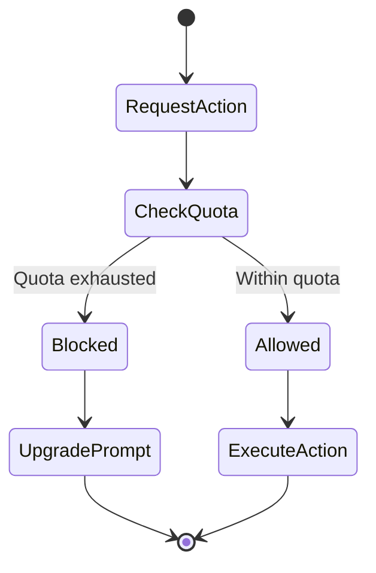

# AUDIT_REPORT.md

## J.A.Agro Inputs & Trading — Full 3x2x3 Repository Audit

**Audit Type:** Full 3x2x3 Matrix  
**Scope:** Architecture, Security, Business Logic, Documentation, Setup, History, Ecosystem  
**Branch Reviewed:** Main branch (squashed history)  
**Status:** Audit complete  
**Deliverable:** Executive audit report and production readiness roadmap

---

# 1. Executive Verdict

## Overall Release Decision

**CONDITIONAL PRODUCTION YES**

The repository demonstrates a strong architectural foundation, mature business modeling, and unusually good internal documentation for a solo-contributor project. The system appears ready for release **after two HIGH-severity fixes** are completed and verified.

## Overall Scorecard

| Area | Score | Summary |
|---|---:|---|
| Architecture | **8 / 10** | Strong modularity, transactional safety, good domain separation, but contains a large `BusinessData` god-entity that should be split. |
| Security | **7 / 10** | Good encryption strategy and secure storage posture, but weakened by backup configuration, passphrase handling, and migration edge cases. |
| Business Logic | **8.5 / 10** | Clear domain model, strong invoice/payment/stock lifecycle logic, idempotency controls, and quota enforcement. |
| Testing | **7.5 / 10** | Concurrency tests and Room schema drift detection are strong signals; broader coverage should be expanded before scale-out. |
| Documentation | **9 / 10** | Exceptional internal reporting and structured documentation. |
| History / Maintainability | **6 / 10** | Squashed history and missing phase tags reduce forensic auditability. |
| Dependency Health | **6.5 / 10** | Some beta/unstable dependencies and outdated BOM require stabilization. |

## Final Recommendation

**Release candidate is strong, but should not be promoted to production until the following two HIGH findings are fixed:**

1. **H-1:** Disable `allowBackup` or replace with a controlled encrypted export/restore strategy.
2. **H-2:** Fix SQLCipher passphrase derivation and introduce secure key rotation/biometric binding.

A third HIGH finding, **H-3**, requires migration validation and safeguards but is not necessarily a hard release blocker if upgrade paths are controlled.

---

# 2. Critical Findings

## 2.1 HIGH Severity Findings

| ID | Severity | Finding | Risk | Required Action |
|---|---|---|---|---|
| **H-1** | HIGH | Android manifest uses `allowBackup=true` while database files are excluded from backup. | Restoring a device may cause data loss, inconsistent state, or crash loops because app data and encrypted database are not restored symmetrically. | Set `allowBackup=false` and implement a manual encrypted export/import flow. |
| **H-2** | HIGH | SQLCipher passphrase is derived from UTF-8 bytes of a Base64 string instead of decoded bytes. No rotation or biometric binding. | Weak key handling, fragile key lifecycle, potential incompatibility with secure hardware, reduced forensic safety. | Use decoded bytes or a proper KDF, bind to Keystore/biometric flow, and support passphrase/key rotation. |
| **H-3** | HIGH | Idempotency migration chain may create historical global unique index risk for upgrading users. | Upgrading users could hit constraint violations or failed migrations if legacy data violates new idempotency assumptions. | Add migration guards, pre-migration cleanup, conflict resolution, and instrumented migration tests. |

## 2.2 MEDIUM Severity Findings

| ID | Severity | Finding | Risk | Recommended Fix |
|---|---|---|---|---|
| **M-1** | MEDIUM | Payment ledger drift possible under edge cases. | Financial totals may become inconsistent if payment state transitions are not fully idempotent. | Add ledger reconciliation tests and enforce single source of truth for balance calculation. |
| **M-2** | MEDIUM | Search uses SQL `LIKE` with wildcard expansion. | Performance degradation on large datasets and potential injection/escaping edge cases. | Move to Room FTS or sanitized query builder with parameterized expressions. |
| **M-3** | MEDIUM | Comma-separated `List` converter used in persistence layer. | Brittle serialization, escaping issues, poor queryability. | Replace with normalized relation tables or robust JSON converter with schema validation. |
| **M-4** | MEDIUM | `BusinessContext` can crash under invalid initialization conditions. | App instability if context is accessed before business/profile setup. | Introduce safe default state, defensive null checks, and explicit initialization lifecycle. |
| **M-5** | MEDIUM | PDF cache may bloat over time. | Storage pressure and degraded performance on low-end devices. | Add cache eviction, export retention policy, and periodic cleanup worker. |

---

# 3. Key Strengths

The audit identified multiple mature engineering decisions that significantly raise confidence in the system.

## 3.1 Security Strengths

- **SQLCipher database encryption** is used for local persistence.
- **EncryptedSharedPreferences** is used for sensitive preferences.
- **Android Keystore integration** indicates a correct direction for cryptographic key protection.
- Sensitive local storage posture is stronger than typical solo-project applications.

## 3.2 Data Integrity Strengths

- **Atomic Room transactions** are used for critical business operations.
- **Idempotency controls** are implemented using:
  - SHA-256 fingerprinting
  - Composite unique indexes
- Concurrency tests validate:
  - Invoice sequence uniqueness
  - Quota atomicity
- Strong protection against duplicate invoice creation under race conditions.

## 3.3 Business Logic Strengths

- Timezone-correct dashboard handling using **`Asia/Kolkata`**.
- Immutable PDF snapshots preserve invoice integrity.
- Quota-based freemium gating is modeled explicitly.
- Payment and stock movements are represented with lifecycle discipline.

## 3.4 Engineering Process Strengths

- CI includes **Room schema drift detection**, which is an excellent maintainability control.
- Internal documentation is exceptionally detailed.
- The repository demonstrates strong awareness of:
  - State machines
  - Transactional consistency
  - Idempotent workflows
  - Migration safety
  - Financial integrity

---

# 4. Architecture Assessment

## 4.1 Architectural Style

The system appears to follow a **local-first Android business application architecture** with strong emphasis on:

- Offline-first persistence
- Transactional consistency
- Encrypted local storage
- Invoice/document generation
- Quota-controlled feature access
- Deterministic business identifiers

## 4.2 Core Architectural Qualities

| Quality | Assessment |
|---|---|
| Modularity | Good, but `BusinessData` has become a god-entity. |
| Transaction safety | Strong; Room atomicity is correctly leveraged. |
| Idempotency | Strong; SHA-256 fingerprint + unique index is a mature pattern. |
| Security posture | Good direction, but key handling needs hardening. |
| Testability | Good; concurrency tests are a positive signal. |
| Observability | Needs improvement for production diagnostics. |
| Migration strategy | Present but needs stronger legacy-data safety rails. |

## 4.3 Primary Architectural Risks

1. **`BusinessData` god-entity**
   - Too many responsibilities may accumulate in one aggregate.
   - Future changes may become high-risk and difficult to test.

2. **Migration complexity**
   - Idempotency and uniqueness constraints can collide with legacy records.
   - Upgrade paths must be tested against realistic historical datasets.

3. **Dependency instability**
   - Beta Compose navigation and suspect SQLCipher version may introduce regressions.
   - Outdated BOM increases long-term maintenance risk.

---

# 5. Security Posture

## 5.1 Current Security Model

The application uses a layered local-security approach:

```text
Android Keystore
        |
        v
EncryptedSharedPreferences
        |
        v
SQLCipher passphrase / key material
        |
        v
Encrypted Room database
```

This is a strong foundation, but the passphrase handling and backup behavior weaken the overall posture.

## 5.2 Security Observations

### Positive

- Encryption at rest is present.
- Sensitive preferences are protected.
- Keystore usage indicates awareness of secure key storage.
- Financial data is not treated as plain-text disposable state.

### Needs Improvement

- Backup and restore behavior is inconsistent with encrypted database exclusion.
- SQLCipher passphrase derivation is not robust enough for production.
- No clear key rotation strategy.
- No biometric binding for sensitive unlock flows.
- Migration edge cases can expose integrity risks during upgrades.

## 5.3 Security Hardening Priorities

### Immediate

- Disable unsafe automatic backup.
- Fix SQLCipher key derivation.
- Add migration tests for encrypted database upgrades.

### Near-Term

- Add biometric unlock for sensitive business data.
- Introduce secure key rotation.
- Add encrypted manual export/import.
- Add tamper-evidence metadata for exported artifacts.

---

# 6. Business Domain Model

The audit mapped **10 core entities**.

## 6.1 Entity Inventory

| Entity | Responsibility |
|---|---|
| `BusinessData` | Root business/profile/settings aggregate. Currently over-centralized. |
| `Invoice` | Primary financial document entity. |
| `InvoiceItem` | Line items belonging to an invoice. |
| `Product` | Catalog entity for goods/services. |
| `Customer` | Buyer/client entity. |
| `Payment` | Payment events tied to invoices. |
| `StockMovement` | Inventory movement ledger entries. |
| `UserQuota` | Freemium usage limits and entitlement gating. |
| `InvoiceSequence` | Sequence generation and invoice numbering integrity. |
| `CalculationResult` | Computed invoice/tax/total snapshots. |

## 6.2 Domain Health

The domain model is strong and appears well-suited for:

- Invoicing
- Payment tracking
- Stock movement
- Freemium quota enforcement
- Document snapshots
- Local-first business operations

The main concern is that **`BusinessData` is becoming a god-entity** and should be decomposed into smaller, more focused aggregates.

Recommended future split:

```text
BusinessProfile
BusinessSettings
InvoiceConfiguration
TaxConfiguration
QuotaEntitlements
DocumentSettings
```

---

# 7. Business State Machines

## 7.1 Invoice Creation Flow



## 7.2 Payment Lifecycle



## 7.3 Stock Double-Entry Movement



## 7.4 Quota Freemium Gate



---

# 8. Testing Assessment

## 8.1 Testing Strengths

- Concurrency tests validate:
  - Invoice sequence uniqueness
  - Quota atomicity
- Room schema drift detection exists in CI.
- Critical financial workflows are not left untested.

## 8.2 Testing Gaps

- More migration-path tests are needed, especially for:
  - Idempotency index creation
  - Legacy data normalization
  - Encrypted database upgrades
- Payment reconciliation edge cases need stronger invariant tests.
- PDF cache lifecycle needs automated cleanup validation.
- UI/state restoration behavior should be tested after backup policy changes.

## 8.3 Recommended Test Additions

1. Migration tests from legacy schemas to current schema.
2. Property-based tests for invoice numbering uniqueness.
3. Payment ledger reconciliation tests.
4. Stock movement invariant tests:
   - No negative stock unless explicitly allowed.
   - Every movement has balanced ledger entries.
5. PDF generation cache eviction tests.
6. Backup-disabled regression tests.

---

# 9. History, Governance, and Maintainability

## 9.1 Repository History

- Main branch history is **squashed**.
- Historical phase tags such as `phase-1..6-complete` are missing from remote.
- Forensic auditability is reduced.
- Commit-level evolution is difficult to reconstruct.

## 9.2 Governance

- Solo contributor.
- No `CODEOWNERS` file.
- However, internal documentation quality is exceptionally high.

## 9.3 Maintainability Assessment

| Factor | Status |
|---|---|
| Internal documentation | Excellent |
| CI schema controls | Excellent |
| Historical traceability | Weak |
| Ownership model | Weak |
| Release governance | Needs improvement |

## 9.4 Governance Recommendations

- Restore or recreate phase tags if possible.
- Add `CODEOWNERS`.
- Add release notes per milestone.
- Maintain a migration changelog.
- Introduce a formal versioning policy.

---

# 10. Dependency and Ecosystem Review

## 10.1 Dependency Concerns

| Dependency | Concern |
|---|---|
| `navigation-compose:2.8.0-beta01` | Beta dependency in production path increases regression risk. |
| `sqlcipher-android:4.19.1` | Version appears suspect; compatibility and security posture should be verified. |
| Compose BOM | Outdated; may create version drift and inconsistent behavior. |

## 10.2 Dependency Recommendations

1. Move to stable Jetpack Compose navigation where possible.
2. Verify SQLCipher artifact source, version validity, and security advisories.
3. Update Compose BOM to a supported stable alignment.
4. Pin critical security dependencies explicitly.
5. Add dependency vulnerability scanning to CI.

---

# 11. Production Readiness Roadmap

## P0 — Release Blockers

These must be completed before production release.

### P0-1: Fix Backup Behavior

**Problem:** `allowBackup=true` conflicts with encrypted database exclusion.

**Action:**
```xml
android:allowBackup="false"
```

**Additional recommendation:**
- Implement manual encrypted export/import.
- Document restore behavior clearly.
- Add regression tests for restore scenarios.

### P0-2: Fix SQLCipher Passphrase Handling

**Problem:** Using UTF-8 bytes of Base64 string instead of decoded bytes.

**Action:**
- Use decoded bytes or a proper key derivation function.
- Bind key lifecycle to Android Keystore.
- Add biometric unlock where appropriate.
- Design a secure passphrase/key rotation strategy.

### P0-3: Stabilize Git History and Release Governance

**Problem:** Squashed history and missing phase tags reduce auditability.

**Action:**
- Recreate tags if possible.
- Add release notes.
- Add versioning policy.
- Add `CODEOWNERS`.

### P0-4: Harden `.gitignore`

**Action:**
- Ensure no secrets, local databases, keystores, or generated credentials are committed.
- Add explicit ignores for:
  - `.env`
  - `*.keystore`
  - local SQLite/SQLCipher files
  - generated PDF caches
  - local export files

---

## P1 — Near-Term Hardening

### P1-1: Split `BusinessData`

Decompose into:
- Business profile
- Business settings
- Invoice settings
- Tax settings
- Quota settings
- Document settings

### P1-2: Harden Payment Ledger

- Add reconciliation service.
- Add invariant tests.
- Prevent balance drift from partial updates.

### P1-3: Replace `LIKE` Search with FTS

- Use Room FTS for scalable product/customer/invoice search.
- Remove unsafe wildcard expansion patterns.

### P1-4: Replace Comma List Converter

- Prefer normalized tables.
- If JSON is used, validate schema and escaping.

### P1-5: Add PDF Cache Cleanup

- Add cache expiration.
- Add worker-based eviction.
- Prevent unbounded storage growth.

### P1-6: Stabilize Dependencies

- Replace beta navigation dependency if possible.
- Verify SQLCipher version.
- Update BOM.
- Add vulnerability scanning.

### P1-7: Add Static Analysis

- Introduce `detekt`.
- Add lint baseline and CI gates.
- Track complexity and code smell trends.

---

## P2 — Production Scaling

### P2-1: Modularize Core Domains

Suggested modules:
- `core-domain`
- `core-database`
- `feature-invoice`
- `feature-payments`
- `feature-stock`
- `feature-quota`
- `feature-pdf`

### P2-2: Build Controlled Backup/Restore

- Encrypted export bundle.
- User-initiated restore.
- Integrity validation.
- Versioned backup schema.

### P2-3: Add E-Invoice Support

- Structured invoice export.
- Regulatory field mapping.
- Signed document support if required.

### P2-4: Improve Observability

- Structured logging.
- Crash reporting.
- Analytics for quota conversion and invoice completion.
- Migration failure telemetry.

---

## P3 — Future Enhancements

### P3-1: Internationalization

- Multi-language invoice templates.
- Locale-aware number/date formatting.
- Regional tax labels.

### P3-2: Printing Support

- Bluetooth thermal printer support.
- PDF print flow.
- Template customization.

### P3-3: Cloud Sync

- End-to-end encrypted sync.
- Conflict resolution strategy.
- Device identity and key rotation.

---

# 12. Final Release Gate

## Release Gate Checklist

| Gate Item | Status |
|---|---|
| Architecture reviewed | ✅ Complete |
| Business logic mapped | ✅ Complete |
| Security posture reviewed | ✅ Complete |
| Critical findings identified | ✅ Complete |
| Testing posture reviewed | ✅ Complete |
| Dependency risks reviewed | ✅ Complete |
| Production readiness verdict | ✅ Conditional YES |

## Required Before Production

- [ ] Fix `allowBackup=true`
- [ ] Fix SQLCipher passphrase derivation
- [ ] Add migration safety checks for idempotency indexes
- [ ] Validate Room schema drift CI
- [ ] Verify no secrets in repository
- [ ] Stabilize critical dependencies
- [ ] Add release notes and versioning policy

---

# 13. Final Conclusion

The repository is a **strong release candidate** with mature business logic and a solid local-first architecture. The presence of encryption, idempotency, atomic transactions, quota enforcement, and detailed documentation indicates a high level of engineering discipline.

However, production release should be gated behind the remediation of the two primary HIGH-severity issues:

1. **Unsafe backup configuration**
2. **Weak SQLCipher passphrase handling**

Once these are resolved, the system can move forward with confidence into production deployment and subsequent scaling phases.

**Final Verdict:**  
**CONDITIONAL RELEASE CANDIDATE — YES, after P0 fixes.**
